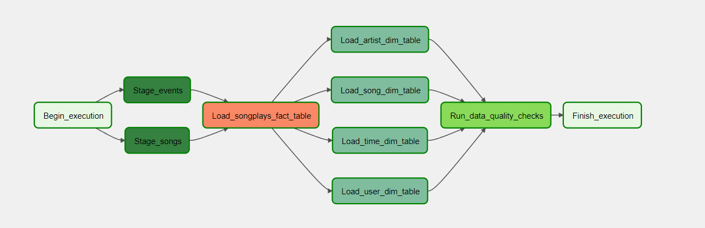

# Project: Data Pipelines

## Project Introduction
A music streaming company, Sparkify, has decided that it is time to introduce more automation and monitoring to their data warehouse ETL pipelines and come to the conclusion that the best tool to achieve this is Apache Airflow.

## Prerequisites

### Prerequisites
- Create an IAM User
- Configure Redshift Serverless
### Setting up Connections
- Connect Airflow and AWS
- Connect Airflow to AWS Redshift Serverlss

## Project Instructions

### Datasets
- Log data: `s3://udacity-dend/log_data`
- Song data: `s3://udacity-dend/song_data`
### Project Template
- The **dag template** 
- The **operator templates**
- The **helper class** for the SQL transformations

<figure>
  
</figure>